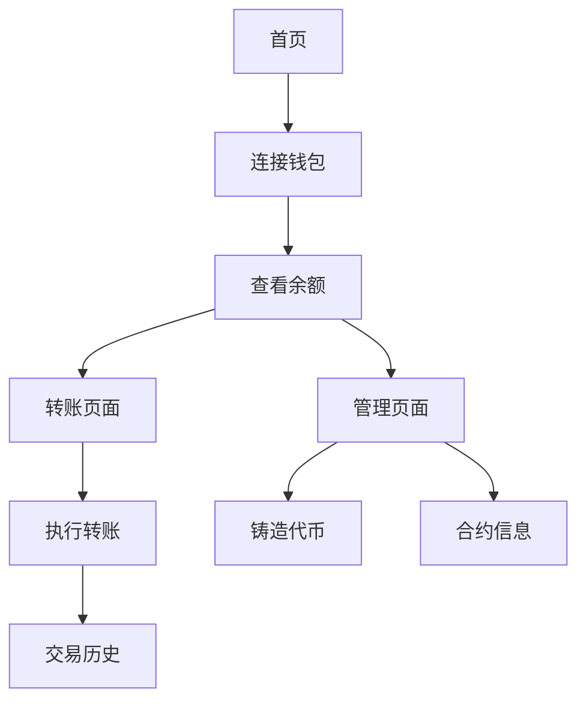

# 智能合约代币管理 DApp 产品需求文档

## 1. Product Overview
一个基于以太坊的简单代币管理去中心化应用（DApp），用户可以通过 Web 界面与智能合约交互，实现代币的发行、转账和余额查询功能。
- 解决传统代币管理需要复杂工具的问题，为普通用户提供简单易用的代币操作界面
- 目标是为区块链初学者提供一个完整的 DApp 开发示例和学习平台

## 2. Core Features

### 2.1 User Roles
| Role | Registration Method | Core Permissions |
|------|---------------------|------------------|
| 合约所有者 | 部署合约的钱包地址 | 可以铸造新代币，查看所有用户余额 |
| 普通用户 | 连接 MetaMask 钱包 | 可以查看自己余额，转账代币给其他用户 |

### 2.2 Feature Module
我们的代币管理 DApp 包含以下主要页面：
1. **首页**：钱包连接、用户余额显示、快速操作入口
2. **转账页面**：代币转账功能、交易历史记录
3. **管理页面**：合约所有者专用，代币铸造和合约信息管理

### 2.3 Page Details
| Page Name | Module Name | Feature description |
|-----------|-------------|---------------------|
| 首页 | 钱包连接模块 | 连接 MetaMask 钱包，显示连接状态和用户地址 |
| 首页 | 余额显示模块 | 实时显示用户的代币余额和以太坊余额 |
| 首页 | 快速操作模块 | 提供转账和管理功能的快速入口按钮 |
| 转账页面 | 转账表单模块 | 输入接收地址和转账金额，执行代币转账交易 |
| 转账页面 | 交易历史模块 | 显示用户的转账记录，包括发送和接收的交易 |
| 管理页面 | 代币铸造模块 | 合约所有者可以向指定地址铸造新的代币 |
| 管理页面 | 合约信息模块 | 显示合约地址、总供应量、所有者信息等 |

## 3. Core Process

**普通用户流程：**
用户首先连接 MetaMask 钱包，系统自动获取用户地址和余额信息。用户可以在首页查看自己的代币余额，点击转账按钮进入转账页面，输入接收地址和金额后确认交易。交易完成后可以在交易历史中查看记录。

**合约所有者流程：**
合约所有者除了拥有普通用户的所有功能外，还可以访问管理页面。在管理页面中，所有者可以向任意地址铸造新的代币，查看合约的详细信息和统计数据。

## 4. User Interface Design
### 4.1 Design Style
- 主色调：深蓝色 (#1e3a8a) 和亮蓝色 (#3b82f6)
- 辅助色：灰色 (#6b7280) 和绿色 (#10b981)
- 按钮样式：圆角按钮，带有悬停效果和渐变背景
- 字体：系统默认字体，标题 24px，正文 16px，小字 14px
- 布局风格：卡片式布局，顶部导航栏，响应式设计
- 图标风格：使用 Heroicons 图标库，简洁现代的线性图标

### 4.2 Page Design Overview
| Page Name | Module Name | UI Elements |
|-----------|-------------|-------------|
| 首页 | 钱包连接模块 | 大型连接按钮，钱包状态指示器，用户地址显示卡片 |
| 首页 | 余额显示模块 | 大数字显示余额，代币符号，刷新按钮，渐变背景卡片 |
| 首页 | 快速操作模块 | 两个并排的操作按钮，图标+文字组合，悬停动画效果 |
| 转账页面 | 转账表单模块 | 输入框带验证提示，确认按钮，交易状态显示，加载动画 |
| 转账页面 | 交易历史模块 | 表格形式显示，时间戳，地址缩略显示，状态标签 |
| 管理页面 | 代币铸造模块 | 管理员专用标识，输入表单，权限验证提示 |
| 管理页面 | 合约信息模块 | 信息卡片布局，复制按钮，统计数据可视化 |

### 4.3 Responsiveness
项目采用移动端优先的响应式设计，使用 Tailwind CSS 的响应式类名。在移动端优化触摸交互，按钮大小适合手指点击，表单输入框在移动端自动放大。桌面端提供更丰富的交互效果和更大的信息密度。