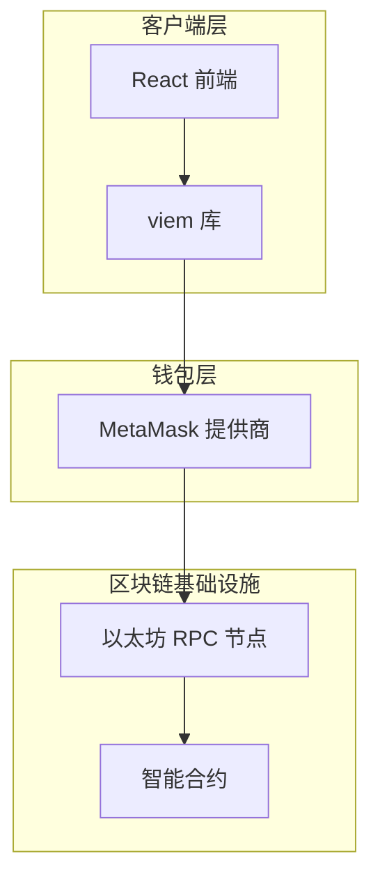
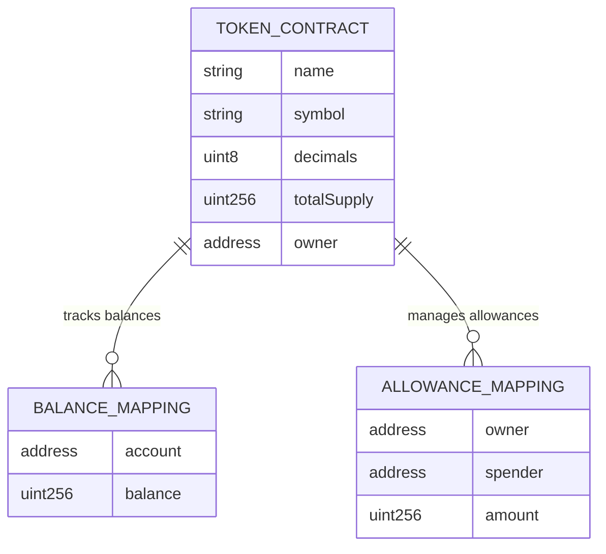

# 智能合约代币管理 DApp 技术架构文档

## 1. Architecture design

```mermaid
graph TD
  A[用户浏览器] --> B[React 前端应用]
  B --> C[viem SDK]
  C --> D[MetaMask 钱包]
  C --> E[以太坊网络]
  E --> F[智能合约]
  G[Hardhat 开发环境] --> F

  subgraph "前端层"
    B
    C
  end

  subgraph "区块链层"
    D
    E
    F
  end

  subgraph "开发工具层"
    G
  end
end
```

## 2. Technology Description

- 前端：React@18 + TypeScript + Tailwind CSS + Vite
- 区块链交互：viem@2
- 智能合约：Solidity@0.8.19
- 开发框架：Hardhat
- 钱包集成：MetaMask

## 3. Route definitions

| Route | Purpose |
|-------|----------|
| / | 首页，显示钱包连接状态和用户余额信息 |
| /transfer | 转账页面，执行代币转账和查看交易历史 |
| /admin | 管理页面，合约所有者专用的代币铸造和管理功能 |

## 4. API definitions

### 4.1 智能合约接口

**代币余额查询**
```solidity
function balanceOf(address account) external view returns (uint256)
```

参数:
| 参数名 | 参数类型 | 是否必需 | 描述 |
|--------|----------|----------|------|
| account | address | true | 要查询余额的账户地址 |

返回值:
| 参数名 | 参数类型 | 描述 |
|--------|----------|------|
| balance | uint256 | 账户的代币余额 |

**代币转账**
```solidity
function transfer(address to, uint256 amount) external returns (bool)
```

参数:
| 参数名 | 参数类型 | 是否必需 | 描述 |
|--------|----------|----------|------|
| to | address | true | 接收代币的地址 |
| amount | uint256 | true | 转账金额 |

**代币铸造（仅所有者）**
```solidity
function mint(address to, uint256 amount) external onlyOwner
```

参数:
| 参数名 | 参数类型 | 是否必需 | 描述 |
|--------|----------|----------|------|
| to | address | true | 接收新铸造代币的地址 |
| amount | uint256 | true | 铸造的代币数量 |

### 4.2 前端 TypeScript 类型定义

```typescript
import { Address, Hash } from 'viem';

// 用户信息类型
interface UserInfo {
  address: Address;
  tokenBalance: bigint;
  ethBalance: bigint;
  isOwner: boolean;
}

// 交易记录类型
interface Transaction {
  hash: Hash;
  from: Address;
  to: Address;
  amount: bigint;
  timestamp: number;
  status: 'pending' | 'confirmed' | 'failed';
}

// 合约信息类型
interface ContractInfo {
  address: Address;
  name: string;
  symbol: string;
  totalSupply: bigint;
  owner: Address;
}

// viem 客户端配置类型
interface ClientConfig {
  chain: Chain;
  transport: Transport;
}
```

## 5. Server architecture diagram

由于这是一个纯前端 DApp 项目，不需要传统的服务器架构。所有的业务逻辑都在智能合约和前端中处理：



## 6. Data model

### 6.1 智能合约数据模型



### 6.2 智能合约代码结构

**SimpleToken.sol - ERC20 代币合约**
```solidity
// SPDX-License-Identifier: MIT
pragma solidity ^0.8.19;

import "@openzeppelin/contracts/token/ERC20/ERC20.sol";
import "@openzeppelin/contracts/access/Ownable.sol";

contract SimpleToken is ERC20, Ownable {
    constructor(
        string memory name,
        string memory symbol,
        uint256 initialSupply
    ) ERC20(name, symbol) {
        _mint(msg.sender, initialSupply * 10**decimals());
    }
    
    function mint(address to, uint256 amount) external onlyOwner {
        _mint(to, amount);
    }
    
    function burn(uint256 amount) external {
        _burn(msg.sender, amount);
    }
}
```

**Hardhat 配置文件结构**
```javascript
// hardhat.config.js
require("@nomicfoundation/hardhat-toolbox");
require("dotenv").config();

module.exports = {
  solidity: "0.8.19",
  networks: {
    localhost: {
      url: "http://127.0.0.1:8545"
    },
    sepolia: {
      url: process.env.SEPOLIA_URL || "",
      accounts: process.env.PRIVATE_KEY ? [process.env.PRIVATE_KEY] : []
    }
  }
};
```

**部署脚本**
```javascript
// scripts/deploy.js
async function main() {
  const SimpleToken = await ethers.getContractFactory("SimpleToken");
  const token = await SimpleToken.deploy(
    "Simple Token",
    "STK",
    1000000 // 1,000,000 tokens initial supply
  );
  
  await token.deployed();
  console.log("SimpleToken deployed to:", token.address);
}
```